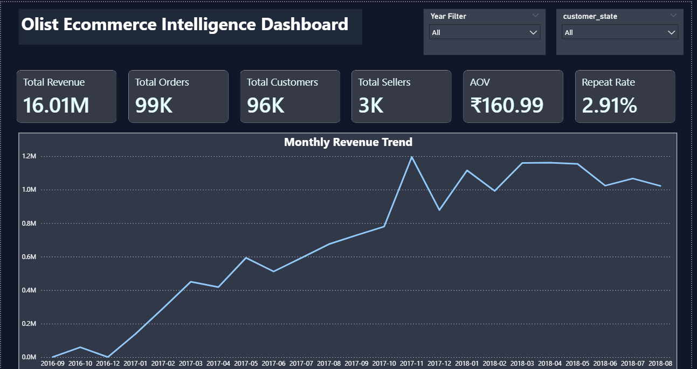
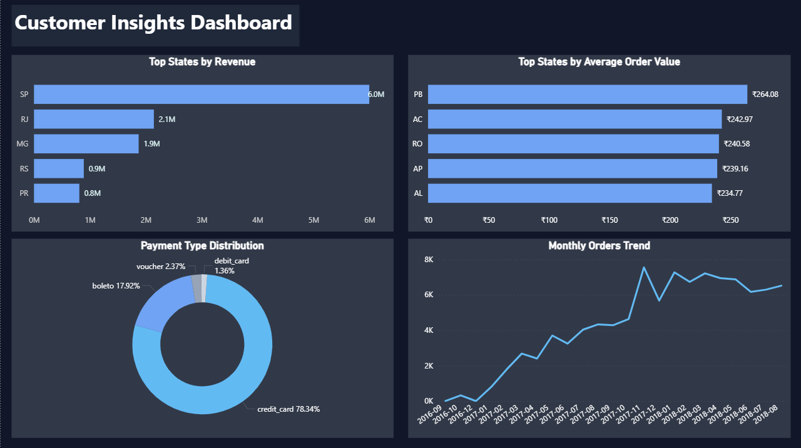
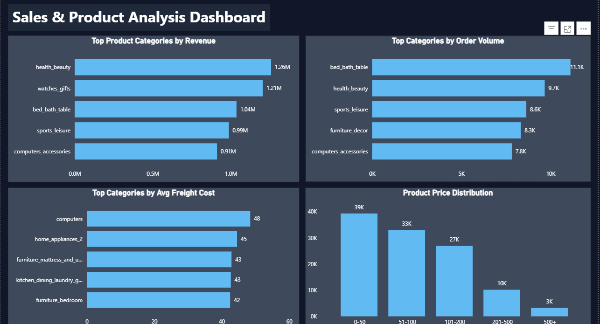
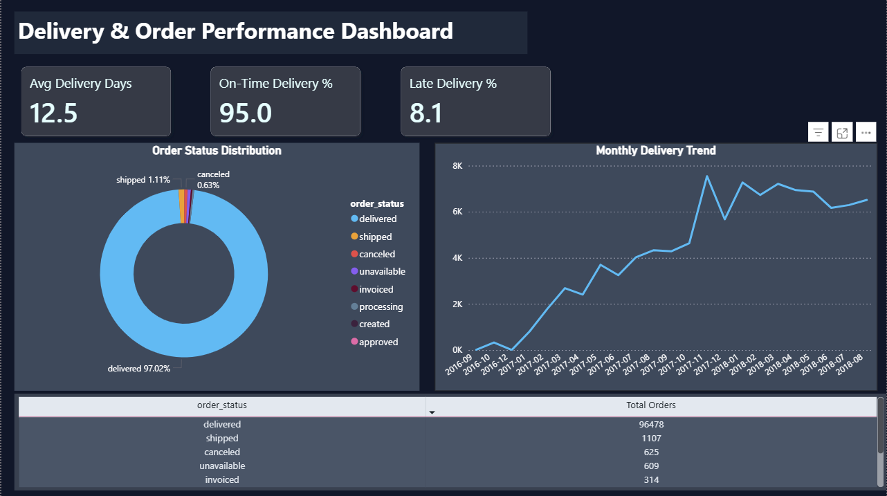

# Olist-Ecommerce-Intelligence-Analytics
End-to-end Ecommerce Business Intelligence project using Excel, SQL, Power BI, and DAX to analyze customer behavior, sales performance, product analytics, and delivery operations through interactive KPI-driven dashboards.

The dashboard suite helps analyze:
- Revenue performance
- Customer purchasing behavior
- Product category analysis
- Delivery & operational performance
- Ecommerce business trends

  # Tools & Technologies Used

- Excel
- MySQL
- Power BI
- DAX
- Data Modeling

# Project Workflow

1. Data Cleaning & EDA using Excel
2. SQL-based Business Analysis
3. Data Modeling in Power BI
4. KPI Creation using DAX
5. Dashboard Development & Storytelling

# Dashboard Pages

## 1. Executive Overview
- Revenue KPIs
- Total Orders
- Unique Customers
- AOV
- Repeat Customer Rate
- Monthly Revenue Trend

## 2. Customer Insights
- Revenue by State
- AOV by State
- Payment Type Distribution
- Monthly Orders Trend

## 3. Sales & Product Analysis
- Top Categories by Revenue
- Top Categories by Order Volume
- Avg Freight Cost by Category
- Product Price Distribution

## 4. Delivery & Order Performance
- Avg Delivery Days
- On-Time Delivery %
- Late Delivery %
- Order Status Distribution
- Monthly Delivery Trend

  # Dashboard Screenshots

## Executive Overview

## Customer Insights

## Sales & Product Analysis

## Delivery & Order Performance

# Key Business Insights

Detailed insights available here:

[View Full Insights](Insights/key_business_insights.md)

# SQL Concepts Used

- JOINs
- GROUP BY
- Aggregate Functions
- DATEDIFF
- CASE Statements
- Top N Analysis
- KPI Queries

# Power BI Features Implemented

- KPI Cards
- DAX Measures
- Slicers
- Top N Filters
- Interactive Dashboards
- Trend Analysis
- Multi-page Reporting
- Business Storytelling

# Resume Project Description

Built an end-to-end Ecommerce Business Intelligence Dashboard using SQL, Power BI, and DAX to analyze sales performance, customer behavior, product analytics, and delivery operations. Developed KPI-driven multi-page dashboards with interactive visualizations, trend analysis, operational metrics, and business storytelling techniques.

# Author

Nitin Raj
B.Tech CSE | Data Analytics Enthusiast
